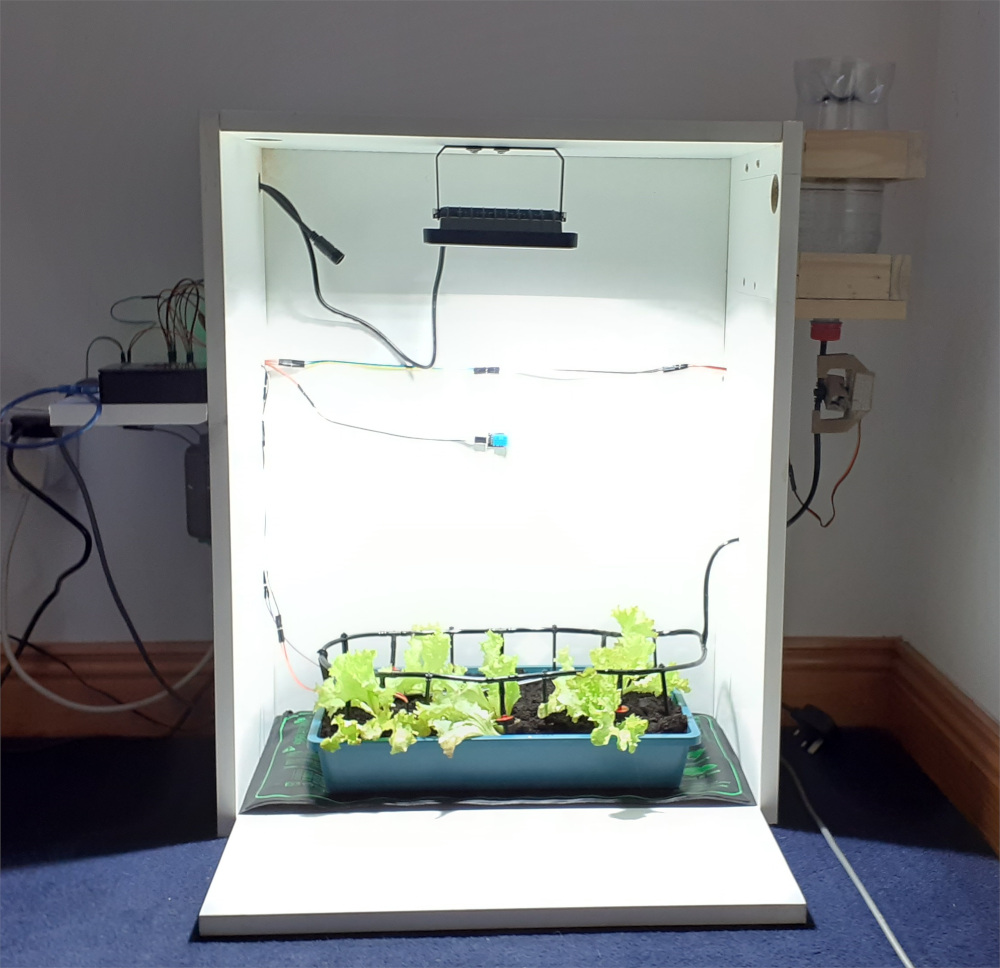
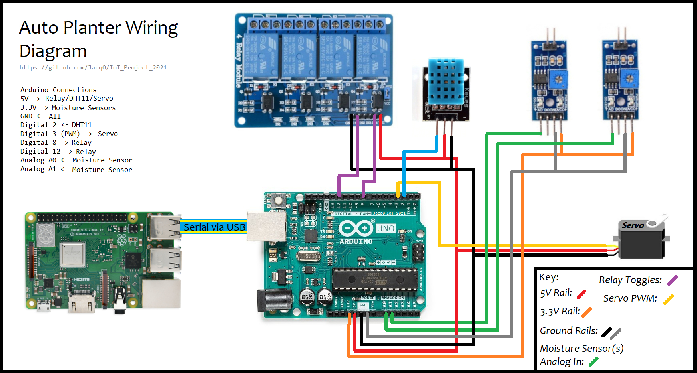
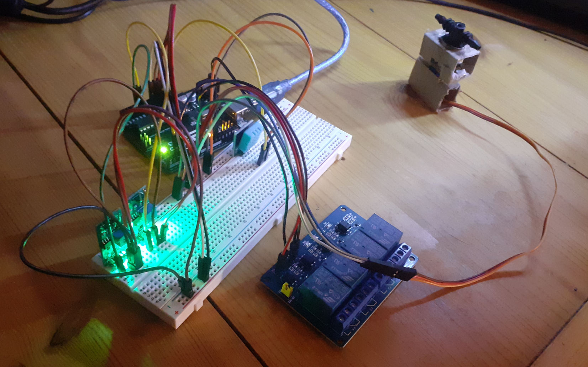

# IoT Project 2021 - Smart Planter
A repository for my 4th semester IoT project, the Smart Planter for fledgling plants.

# Project Setup:
## Introduction

A small planter for germinating and growing fledgling or small plants. It is automatically monitored by sensors hooked up to an Arduino. This data is then sent to the Raspberry Pi via USB, which is the brains of the operation and makes decisions based on the data. A Blynk home server is hosted on the Pi and the Blynk app is used to monitor and control aspects of the planter.

## Equipment used in the Project
- Arduino
- Raspberry Pi
- DHT11 Sensor
- 2x Soil Moisture Sensors
- Relay Module
- Servo
- Growing Light
- Heat Mat

## How does it work?
Each component of the system plays a different role, they are seperate and communicate between each other. The Arduino is used to manage and read data from the sensors, as well as recieve input for actions from the Pi. It sends and recieves this data through USB. 

The Raspberry Pi is the heart of the system. It hosts a local Blynk server, allowing functionality with the Blynk app. Its also processes data from the Arduino and sends actions, like toggling the lights or turning the servo (Which is attached to a valve for the watering system). This is done on the Pi to allow seamless integration with the Blynk app and avoiding multiple seperate controlling scripts!
The Pi has a script that deals with the Arduino and Blynk. This script takes in data from the Arduino and processes it, taking actions whereever it can, the user can override many of these actions for their own. The script also sends data to Blynk so it can be displayed to the user!

## How was is done?
 
### 1. Hardware
The wiring for the system is relatively straight forward. Below is a simplified wiring diagram and a picture of the nest of wiring around the arduino on my desk during testing. Any devices that require mains (Like the light and heat mat) are fed through the relay module, which is not shown in the diagram.

The diagram should just be used as guidance. Adding more or different sensors and devices to this setup should be simple to do. Pinouts and voltage levels for sensors and devices are easily found online if you are stuck! 

*[SAFETY NOTICE: If you are dealing with mains voltage always remember to be safe, know what you are doing and triple check it. If you don't know what you are doing I would highly recommend doing some research or simply ommiting any relays and mains electronics from your project. The danger isn't just getting a nasty and potentially fatal shock; a poorly wired circuit or a short on the mains can also be a fire hazard! Many of these devices can be implemented in their basic form such as lights or heating by simply plugging them in, and many also have their own timer built it. That would be a more advisable route than dealing with relays and mains voltages head on!]*

*(These images are also included in the Images folder in the repo if you need to take a closer look)*

### 2. Software

#### Step 1: Connect your Arduino and Code
You will need the Arduino IDE for this step, which can be found [here.](https://www.arduino.cc/en/software) or you can install it on the Pi using:

`sudo apt-get install arduino`

Once you have it installed, plug in your Arduino, select the correct version (Uno, Nano, Mega, etc.) and make sure you can connect with it. It can usually be found on one of the COM ports on Windows, or /dev/ttyACM- on the Raspberry Pi. I would recommend doing it through the Pi, as we will be connecting it for serial comms later, and it makes it much easier to integrate! 

*In the folder "Arduino" in this repo is the code I used for my Project. Feel free to copy it, take inspiration or make your own. Once this is done upload it to the Arduino using the IDE and that's it!*

#### Step 2: Set up the Blynk Server on the Pi.
Moving on to the Pi, make sure you have an updated version of the OS installed on the Pi. The first thing we must do is install the Blynk server on the Raspberry Pi. A deatiled guide for this can be found [here.](https://github.com/blynkkk/blynk-server) 

Once this is done we now need to check if it is working. Download the Blynk app onto your Phone, make an account and using 'ifconfig' on the Pi check the IP address. 

On the log in screen select the icon at the bottom, switch to custom and type in the IP from the Pi and well as the correct Port number (Usually 9443). More details are found in the link above, it has a section on the Blynk app!

#### Step 3: Set up the Pi as a Blynk device.
If you create a new project on Blynk, it will ask you to select a device. Scroll down and select the appropriate device (in this case the Pi 3B). Now we need to set up the Pi as a valid device. A guide for this can be found on [this](http://docs.blynk.cc/#hardware-set-ups-raspberry-pi) page.

Make sure at this point to create a Blynk project on your server, selecting the correct device (a Raspberry Pi in this context) and get the auth code, you will need that for the next step!

#### Step 4: Programming the Pi.
We are using Python for this step, first make sure you have Python installed on your Pi and the blynklib library for it installed too. Python is usually installed by default, but its best to check. `python --version`

After this use `pip` to install the blynklib library. I used an older version and had better luck with it, but they are very similar.

`sudo pip install blynk-library-python`

Or for the newer one:

`sudo pip install blynklib`

A more detailed installation guide can be found [here.](https://github.com/blynkkk/lib-python)

Once this is complete you are ready create a script and to program the Pi. Choose a text or code editor of your choice and go ham! Create a python script with the blynk library and the auth code and run it. The project on your Blynk app where you got the auth code should show the device (The Pi in this case) as being online.

If you are connecting the script to your server, the port will ususally be 8080 or 80 instead of 9443, make sure to keep this in mind!

*My script is in the folder "RaspberryPi" in this repo, again feel free to use it or take it as inspiration or guidance. I will not go in depth for this step, you can check out the code yourself or look up guides if you need more detail.*

*Essentially the script reads the serial in from the Arduino and takes actions based on what happens. Usually it sends a number back to the arduino corresponding to an action, like switching a relay or turning the servo. The code also manages input and output to Blynk, reading user inputs and sending the data out for the user!*

#### That's it! Now go forth and grow!

## Other links that helped:

Excluding links already included in the project:

Solving issues with device being offline: [https://community.blynk.cc/t/solved-raspberry-server-device-offline/11266/11](https://community.blynk.cc/t/solved-raspberry-server-device-offline/11266/11)

Not recieving Auth Codes: [https://community.blynk.cc/t/auth-token-not-received/30064/2](https://community.blynk.cc/t/auth-token-not-received/30064/2)

Hardware Port Information: [https://community.blynk.cc/t/about-hardware-port-in-local-blynk-server/27058](https://community.blynk.cc/t/about-hardware-port-in-local-blynk-server/27058)

Virtual Pin Issues: [https://community.blynk.cc/t/virtual-pin-unexpectedly-stopped-working/25497/4](https://community.blynk.cc/t/virtual-pin-unexpectedly-stopped-working/25497/4)

Connection issues with Server: [https://community.blynk.cc/t/unable-to-connect-to-local-server/24468/10](https://community.blynk.cc/t/unable-to-connect-to-local-server/24468/10)

Video Tutorial of Blynk Server Install on a Pi (If you prefer that): [https://www.youtube.com/watch?v=SD_ke78N7-4](https://www.youtube.com/watch?v=SD_ke78N7-4)

#### Some stuff I attempted to implement, that might be worth looking at: 

[A better serial Queue.](https://pymotw.com/2/Queue/)

[Blynk on a seperate Script.](https://datatofish.com/one-python-script-from-another)

[Subprocessing.](https://docs.python.org/3/library/subprocess.html)

#### And finally a big thanks to my Lecturer for his continuted support throughout!
